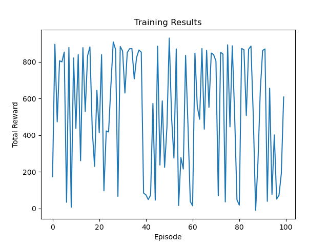
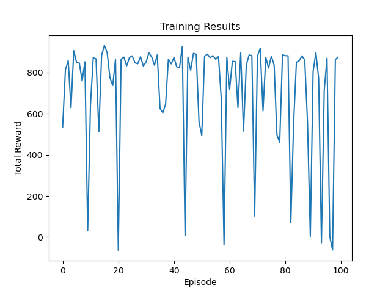

# CarRacing Reinforcement Learning Project

This project implements a Deep Q-Network (DQN) agent with a Convolutional Neural Network (CNN) architecture to play the CarRacing-v2 environment from OpenAI Gym. The agent learns to navigate a race track using reinforcement learning techniques and processes visual input through a CNN. The reward of the environment was modified to encourage the car to move forward and discourage not moving, in doing so increased the speed of the model significantly.


## Table of Contents
1. [Installation](#installation)
2. [Usage](#usage)
3. [Project Structure](#project-structure)
4. [Key Components](#key-components)
5. [Network Architecture](#network-architecture)
6. [Training Process](#training-process)
7. [Results](#results)
8. [Acknowledgments](#acknowledgments)
9. [Future Improvements](#future-improvements)
10. [License](#license)

## Installation

1. Clone this repository:
   ```
   git clone https://github.com/KianAnd19/NN-car-racing.git
   cd NN-car-racing
   ```

2. Create a virtual environment (optional but recommended):
   ```
   python -m venv venv
   source venv/bin/activate
   ```

3. Install the required packages:
   ```
   pip install -r requirements.txt
   ```

## Usage

To train the agent:
```
python train.py
```

To watch a trained agent play:
```
python run.py (args 0-5, chooses which model to run)
```

To generate metrics for 100 trials:
```
python test.py
```

To record a trained agent playing:
```
python record.py
```


## Project Structure

- `train.py`: Main script for training the agent
- `run.py`: Script to watch a trained agent play
- `test.py`: Script to run the model of a specfied amount of times and generate metrics.
- `network.py`: Contains the neural network architecture
- `models/`: Directory to store trained models
- `results/`: Directory to store training results and plots

## Key Components

1. **Environment**: CarRacing-v2 from OpenAI Gym
2. **Algorithm**: Deep Q-Network (DQN) for reinforcement learning
3. **Neural Network**: Convolutional Neural Network (CNN) for processing image input
   - Processes raw pixel data from the game screen
   - Extracts relevant features for decision making
4. **Replay Buffer**: Stores and samples experiences for training
5. **Epsilon-Greedy Exploration**: Balances exploration and exploitation during training

## Network Architecture

The network architecture was adapted from https://towardsdatascience.com/applying-a-deep-q-network-for-openais-car-racing-game-a642daf58fc9. 

This CNN model processes 96x96 grayscale images and outputs 5-dimensional vectors.

**Layer Structure:**

- Input: (batch_size, 1, 96, 96)
- Conv1: 6 filters, 4x4 kernel, stride 4, ReLU
- Conv2: 24 filters, 4x4 kernel, stride 1, ReLU
- MaxPool: 2x2 kernel
- Flatten
- FC1: 1000 neurons, ReLU
- FC2: 256 neurons, ReLU
- Output (FC3): 5 neurons (no activation)

The model dynamically calculates the size of flattened features to adapt to potential input size changes.

## Training Process

The agent is trained using the following process:
1. Initialize the CarRacing-v2 environment
2. Set up the DQN with CNN architecture
3. For each episode:
   - Reset the environment
   - Preprocess the initial state (convert to grayscale, normalize)
   - For each time step:
     - Pass the preprocessed state through the CNN
     - Choose an action using epsilon-greedy strategy
     - Take the action and observe the next state and reward
     - Preprocess the next state
     - Store the experience (state, action, reward, next_state, done) in the replay buffer
     - Sample a batch from the replay buffer
     - Perform a DQN training step:
       - Compute Q-values for current states using the CNN
       - Compute target Q-values for next states
       - Calculate loss and update the network weights
   - Update the target network periodically
4. Save the trained model

### Training runs
- **Training run 1**:
    - ***Epochs:*** 600
    - ***Epsilon:*** intitial=1, end=0.01, decay=0.99
    - ***Reward:*** standard reward from env
- **Training run 2**:
    - ***Epochs:*** 600
    - ***Epsilon:*** initial=0.5, end=0.01, decay=0.995
    - ***Reward:*** Modified reward to give a bias towards moving forward, specifically +0.1 if forward was chosen, also modified the random sample to have a 50% chance of selecting forward.
- **Training run 3**:
    - ***Epochs:*** 600
    - ***Epsilon:*** initial=0.5, end=0.01, decay=0.995
    - ***Reward:*** Modified reward to give a bias towards moving forward, specifically +0.1 if forward was chosen, also modified the random sample to have a 50% chance of selecting forward. Also give a penalty for choosing 0 or 4 which do nothing, -0.05 and -0.1 respectively.
- **Training run 4**:
    - ***Epochs:*** ~5000 (was supposed to be 2000 but by mistake set it to 20000, but I managed to stop it prematurely)
    - ***Epsilon:*** initial=0.2, end=0.01, decay=0.997
    - ***Reward:*** Same as run 3.

## Results

The best and last models of the last training run were compared, while the best had the potential to get higher rewards, it was also more erratic and was less accurate in general, the figures and metrics can be seen below.

### Best


- **Average reward**: 532.5839871963057
- **Standard deviation**: 324.5872739162172
- **Minimum reward**: -10.475438596489752
- **Maximum reward**: 929.6999999999872


### Last


- **Average reward**: 723.7228366586651
- **Standard deviation**: 266.8160548923872
- **Minimum reward**: -65.40880503144722
- **Maximum reward**: 932.2999999999965

## Acknowledgments

- https://towardsdatascience.com/applying-a-deep-q-network-for-openais-car-racing-game-a642daf58fc9 (For the convolutional neural net architecture)
- https://pytorch.org/tutorials/intermediate/reinforcement_q_learning.html (For a general understanding of reinforcement learning and also the active plot of the rewards during training)

## Future Improvements

- Experiment with different CNN architectures
- Implement Prioritized Experience Replay
- Try advanced DQN variants (e.g., Double DQN, Dueling DQN)
- Explore other RL algorithms (e.g., PPO, SAC) while retaining the CNN architecture
- Implement multi-agent training with shared CNN features

## License

This project is licensed under the MIT License - see the [LICENSE](LICENSE) file for details.
